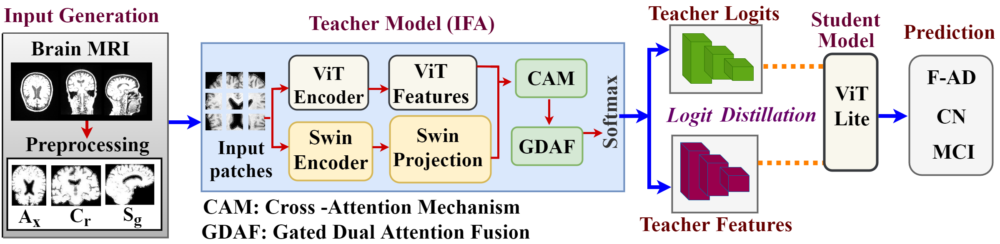
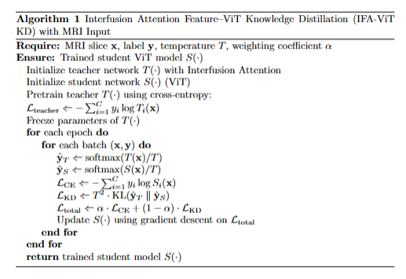

# IFA-ViT-Knowledge-Distillation-
Attention-guided cross-representation distillation framework integrating ViT and SWT is proposed to capture global and local features for AD classification. A gated dual-teacher single-student architecture with interfusion attention fusion (IFA) transfers attention knowledge to a lightweight ViT-Lite student for efficient AD stage identification.

Framework

Key Features:
•	Dual Teacher–Single Student knowledge distillation framework
•	Interfusion Attention Fusion (IFA) combining ViT and Swin Transformer
•	Lightweight ViT-Lite student model
•	Multi-plane MRI analysis (Axial, Coronal, Sagittal)
•	Attention-guided knowledge transfer
•	Grad-CAM and LIME interpretability analysis
•	Evaluated on ADNI and AIBL datasets
•	Achieves up to 98.8% classification accuracy

Datasets: The framework was evaluated on the following benchmark datasets:
Alzheimer’s Disease Neuroimaging Initiative (ADNI)
Australian Imaging, Biomarker & Lifestyle Flagship Study of Ageing (AIBL)
MRI Modalities
•	T1-weighted MRI
•	T2-weighted MRI
AD Stages
•	CN (Cognitively Normal)
•	MCI (Mild Cognitive Impairment)
•	F-AD (Firm Alzheimer’s Disease)
Dataset Links
•	ADNI: https://ida.loni.usc.edu/home/projectPage.jsp?project=ADNI
•	AIBL: https://ida.loni.usc.edu/home/projectPage.jsp?project=AIBL

Framework

Citation
If you use this work, please cite:

@article{barman2026,
  
  title={Attention-Guided Cross-Representation Distillation for Alzheimer’s Stage Identification Employing MRI Scans},
  
  author={Barman, Chandita and Barma, Shovan},
  
  journal={Neural Computing and Applications},
  
  year={2026}

}
________________________________________
Contact
Chandita Barman
PhD Research Scholar
Email: chandita.barman@iiitg.ac.in
